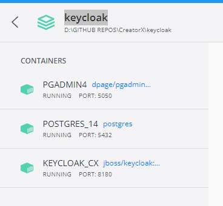
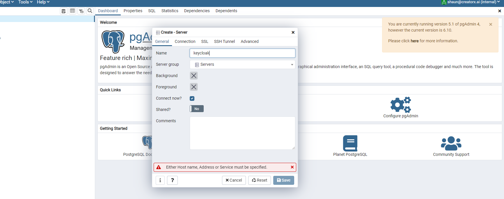
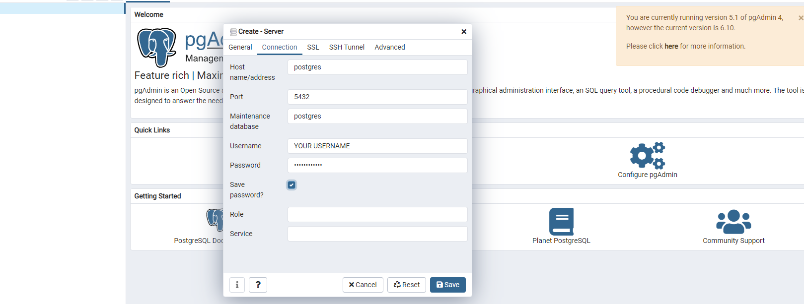
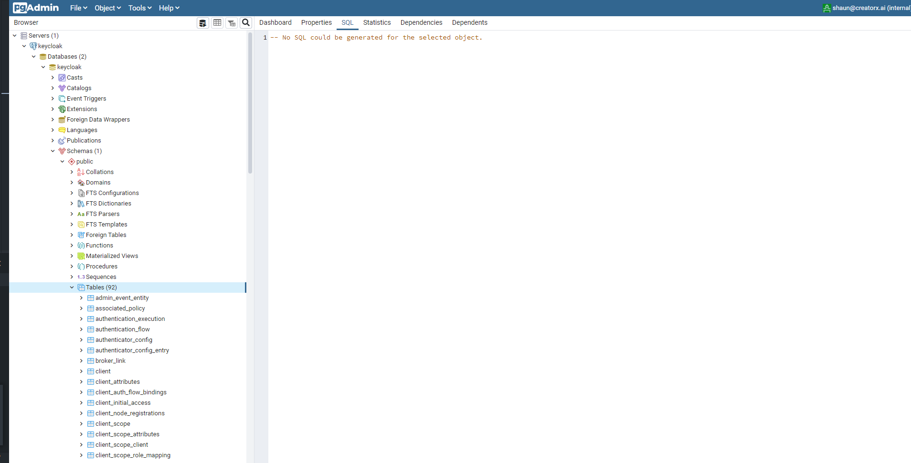

# **Setup of Keycloak with Postgress and PgAdmin4 in Docker**

1. Clone the repository
2. Go to ```docker-compose.yml``` and rename your containers to whatever you like.
3. Set username and password in the ```database.dev.env``` file or use the default
4. Set Keycloak username and password in the ```keycloak.dev.env``` file or use the default
5. Run ```docker compose up -d```

## **Setup Keycloak docker build**

This will build the initial containers the Keycloak will most likely fail after being built and will not be able to initialize. To fix this comment out the following in the ```keycloak.dev.env```

```
#KEYCLOAK\_USER: admin
#KEYCLOAK\_PASSWORD: Pa55w0rd
```

**Instructions for the above method where solved using the following:**

[User name in database exist error - Stack Overflow](https://stackoverflow.com/questions/59599620/keycloak-8-user-with-username-admin-already-added)

1. Restart the Keycloak build with the usernames commented out this will initialize Keycloak. Open localhost:8180 to verify initialization.
2. After verification stop the initial Keycloak container.
3. After the stop of initialization uncomment the username and password and

```
KEYCLOAK\_USER: admin
KEYCLOAK\_PASSWORD: Pa55w0rd
```


1. Restart the server and login to Keycloak and you should see the following in Docker Desktop (


1. Go set up database in postgres

## **Setup postgres Database for incoming Keycloak data**

1. Login to pgadmin4 at localhost:5050



1. Add a new server
2. Call it **Keycloak in the general tab** to match the quires params specified in the initialization of the docker instance.


1. Set up the DB and add your user credentials created in the ```database.dev.env```







_ **Now set up the realm and authorization server and connect a client to interact with it.** _

_ **Also, your docker containers are now set up inside Docker Desktop therefore you can spin them up inside there instead of using docker compose.** _

-or-

**use the CLI:**

```_**docker compose start [SERVICE...]**_```

## **Docker Compose Overview**

```
version: &quot;3.9&quot;

services:

postgres:

container\_name: POSTGRES\_14

image: &quot;postgres&quot;

volumes:

- ./db-data:/var/lib/postgresql/data/

- ./sql:/docker-entrypoint-initdb.d/:ro

env\_file:

- ./database.dev.env

ports:

- &quot;5432:5432&quot;

networks:

- backend

pgadmin:

container\_name: PGADMIN4

image: &quot;dpage/pgadmin4:5.1&quot;

env\_file:

- ./database.dev.env

ports:

- &quot;5050:80&quot;

networks:

- backend

keycloak:

container\_name: KEYCLOAK\_

image: &quot;jboss/keycloak:15.0.2&quot;

env\_file:

- ./keycloak.dev.env

depends\_on:

- &quot;postgres&quot;

ports:

- &quot;8180:8080&quot;

- &quot;8787:8787&quot;# debug port

networks:

- backend

networks:

backend:

name: backend

driver: bridge

```

1. Creates instance of POSTGRES available on port 5432
2. Generates ```db-data schemas```
3. Runs ```sql``` scripts
4. Creates instance of ```PGADMIN``` available on port ```5050```
5. Creates instance of Keycloak on port ```8180```
6. Ties each instance together under a bridge network

If you want the latest version for ```POSTGRES``` ```KEYCLOAK``` OR ```PGADMIN``` see the latest docker documentation as shown below or remove the version number or just put the latest after the image\_name for any of the 3 images.

```image: jboss/keycloak;```

Or

```image:jboss/keycloak:latest;```

Change the name to whatever you like. Just make sure they do not conflict with anything else.

```Container\_name: YOUR\_POSTGRESS\_CONTIANER\_NAME```

## **Troubleshooting:**

If you have to reinitialize the containers because of the crash or fail make sure they are stopped and run this CLI command.

```$ docker system prune```

## **Resources**

- Keyclaok YML docker postgress [https://github.com/keycloak/keycloak-containers/blob/main/docker-compose-examples/keycloak-postgres.yml](https://github.com/keycloak/keycloak-containers/blob/main/docker-compose-examples/keycloak-postgres.yml)
- Troubleshooting [https://stackoverflow.com/questions/59599620/keycloak-8-user-with-username-admin-already-added](https://stackoverflow.com/questions/59599620/keycloak-8-user-with-username-admin-already-added)
- Keycloak official documentation [https://www.keycloak.org/documentation](https://www.keycloak.org/documentation)
- Docker Keycloak image page [https://hub.docker.com/r/jboss/keycloak/](https://hub.docker.com/r/jboss/keycloak/)
- Docker networking overview [https://docs.docker.com/network/](https://docs.docker.com/network/)